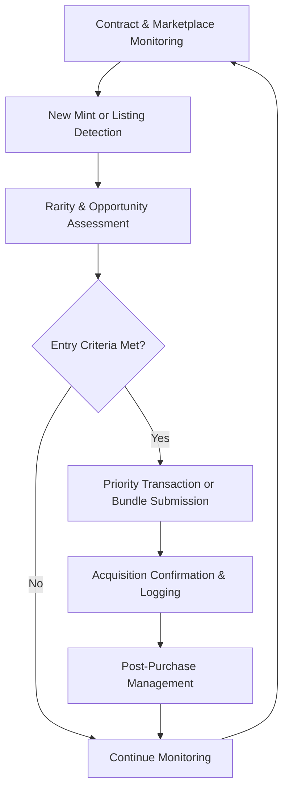

# NFT Sniping Tool

Deploy NFT Sniping Tool as a high-speed launch monitoring and automated minting execution layer for detecting new NFT drops, floor price movements, and rare trait opportunities with priority transaction submission and risk controls on Ethereum, Solana, and major marketplaces.

### Introduction to NFT Sniping Automation Systems

NFT launches and secondary market opportunities move extremely fast. An **NFT Sniping Tool** functions as a specialized **event listener and rapid transaction execution engine** that detects new mints, floor listings, and rare traits then executes purchases with optimized parameters.

Collectors, traders, and automation developers use these tools to secure early positions in high-demand drops and capitalize on secondary market inefficiencies.

### Inside the System: Core Mechanism

The tool operates as a **blockchain event subscription and bundle submission layer**. It monitors:

- New NFT contract deployments and mint events
- Floor price movements and rare trait listings
- Whitelist and allowlist opportunities
- Secondary marketplace activity (OpenSea, Magic Eden, etc.)

Upon detection, the execution engine constructs transactions with priority fees or bundles for near-instant inclusion, managing gas and slippage for competitive edge.

### Target Audience and Practical Use Cases

This execution layer targets:
- NFT collectors seeking rare or early mints
- Flippers targeting secondary market inefficiencies
- Automated trading systems for NFT markets
- Project teams monitoring competitor launches

Common applications include:
- **Public mint sniping** with priority fees
- **Whitelist mint automation**
- **Rare trait hunting** on secondary markets
- **Floor price arbitrage** across marketplaces

### Technical Architecture and Operational Logic

A robust NFT Sniping Tool includes:

- **Event Subscription Layer**: Real-time monitoring of mint contracts and marketplaces
- **Opportunity Analysis Engine**: Rarity and price assessment
- **Execution Core**: Priority fee or bundle submission
- **Risk Management Module**: Budget limits and slippage controls
- **Monitoring Dashboard**: Real-time acquisition tracking

**Operational Logic Flowchart**

### Key Features and Technical Advantages

- **Ultra-Fast Detection**: Sub-second alerts for new drops
- **Priority Execution**: Jito bundles or maximum priority fees
- **Rarity Analysis**: Trait-based filtering for high-value NFTs
- **Multi-Chain Support**: Ethereum, Solana, and major NFT ecosystems
- **Risk Controls**: Budget limits and automated selling rules

The architecture delivers competitive performance in fast-paced NFT markets.

### Where It Fits in the Market: Comparison Table

| Aspect                | NFT Sniping Tool        | Manual Sniping        | Marketplace Tools     | General Trading Bots |
|-----------------------|-------------------------|-----------------------|-----------------------|----------------------|
| Detection Speed      | Sub-second             | Slow                  | Platform-dependent    | Moderate             |
| Execution Reliability| Priority bundles       | Variable              | Standard              | Basic                |
| Rarity Filtering     | Advanced               | Manual                | Basic                 | Limited              |
| Automation Depth     | Full detect-to-acquire | None                  | Limited               | Moderate             |
| Best Use Case        | Competitive mint sniping | Selective entries   | Browsing              | General trading      |
| Technical Complexity | Moderate               | Low                   | Low                   | Moderate             |

### Risk Surface and Limitations

NFT sniping involves extreme risks:
- **Rug-Pull & Scam Exposure**: Many launches are fraudulent
- **High Competition**: Popular drops have intense bidding wars
- **Financial Loss**: Overpaying or buying low-value NFTs is common
- **Gas Waste**: Failed mint transactions incur fees
- **Regulatory Uncertainty**: Automated NFT trading may have compliance implications

**Optimization Note**: Research projects thoroughly, use small position sizes, set strict budget limits, and verify contracts before large commitments. Treat NFT sniping as high-risk speculation.

### Deployment Profile and Getting Started

1. **Infrastructure**: Premium low-latency RPCs and priority fee services.
2. **Configuration**: Define target collections, budget, and risk parameters.
3. **Testing**: Simulate on testnets or low-stakes drops.
4. **Live Operation**: Enable with continuous monitoring and performance tracking.
5. **Maintenance**: Update detection logic as marketplace mechanics evolve.

Many implementations build on open-source Solana/Ethereum sniping frameworks with custom NFT-specific logic.

### Conclusion

The NFT Sniping Tool serves as a high-speed launch monitoring and acquisition execution engine optimized for competitive NFT markets. Its value lies in rapid detection, priority execution, and risk-aware decision making rather than any guaranteed profits. For technically proficient users who maintain strict risk discipline and realistic expectations, it provides a powerful tool for participating in high-velocity NFT opportunities.

### FAQ

**How competitive is NFT sniping in 2026?**  
Extremely competitive. Success requires premium infrastructure, optimized bundles, and continuous strategy refinement.

**Does it support Solana and Ethereum NFT mints?**  
Yes. Implementations adapt to each chain’s mint mechanics and marketplace APIs.

**What are the main risks?**  
Rug pulls, overpaying, gas waste on failed transactions, and high volatility. Strict risk management is essential.

**What are the main costs?**  
Priority fees, gas, and potential overpayment. Success requires these to be outweighed by acquiring valuable NFTs.

**How does it compare to manual sniping?**  
Automation provides reaction speeds and consistency impossible for humans, but requires technical setup and cannot eliminate the inherent high risk of NFT launches. Many users combine both approaches.
